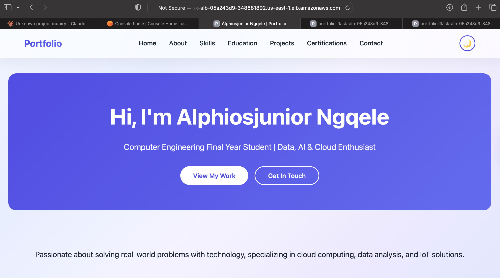
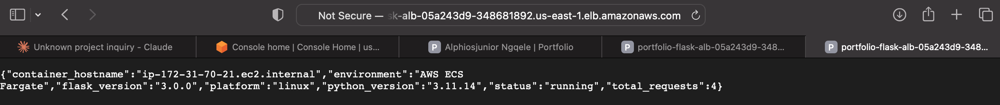
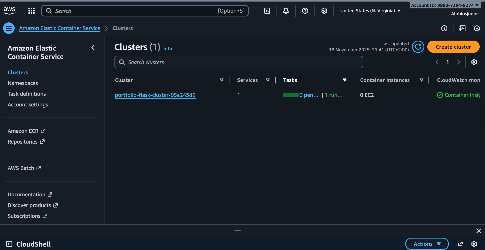
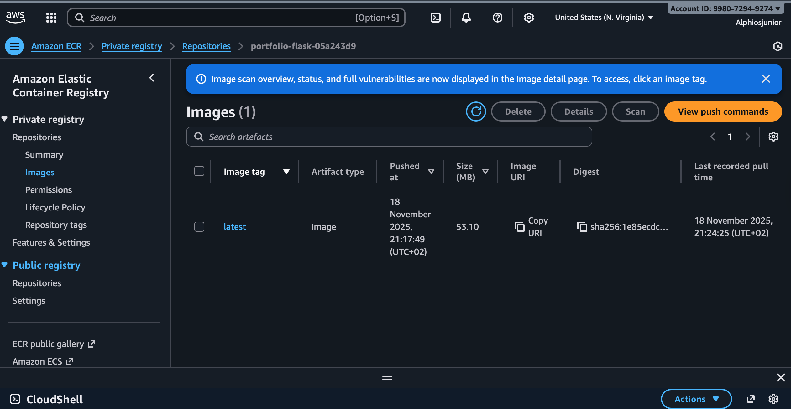

# 🐳 Containerized Portfolio Deployment - AWS ECS Fargate

Production-grade containerized web application deployment using Docker, AWS ECS Fargate, ECR, and Terraform.

## 🚀 Project Overview

This project demonstrates modern containerization and orchestration by deploying my personal portfolio website as a Docker container on AWS ECS Fargate - a serverless container platform. The entire infrastructure is provisioned and managed as code using Terraform.

## 🏗️ Architecture

```
Flask Application (Python)
        ↓
Docker Container (Packaged App)
        ↓
AWS ECR (Container Registry)
        ↓
ECS Fargate (Serverless Container Orchestration)
        ↓
Application Load Balancer
        ↓
Public HTTPS Endpoint
```

### Architecture Components:

- **Application**: Flask web server serving portfolio website
- **Containerization**: Docker for portable, consistent deployments
- **Registry**: AWS ECR for secure container image storage
- **Compute**: ECS Fargate for serverless container execution
- **Networking**: Application Load Balancer with health checks
- **Security**: VPC, Security Groups, IAM roles with least privilege
- **Monitoring**: CloudWatch Logs for container monitoring
- **IaC**: Terraform for reproducible infrastructure

## 🛠️ Technologies Used

| Technology          | Purpose                 | Version        |
| ------------------- | ----------------------- | -------------- |
| **Python**          | Application runtime     | 3.11           |
| **Flask**           | Web framework           | 3.0.0          |
| **Docker**          | Containerization        | Latest         |
| **AWS ECS Fargate** | Container orchestration | Serverless     |
| **AWS ECR**         | Container registry      | -              |
| **AWS ALB**         | Load balancing          | Application LB |
| **Terraform**       | Infrastructure as Code  | 1.13+          |
| **AWS CloudWatch**  | Logging & monitoring    | -              |

## ✨ Key Features

### Application Features:

- ✅ Responsive portfolio website
- ✅ Health check endpoint for ECS monitoring
- ✅ Container info API showing hostname, request count
- ✅ Production-ready Flask configuration

### Infrastructure Features:

- ✅ Fully automated infrastructure deployment
- ✅ Serverless container execution (no EC2 management)
- ✅ Auto-scaling capabilities (configurable)
- ✅ High availability across multiple AZs
- ✅ Application Load Balancer with health checks
- ✅ Secure networking with Security Groups
- ✅ IAM roles with least privilege access
- ✅ CloudWatch logging for debugging
- ✅ 100% Infrastructure as Code

## 📋 Infrastructure Components

| AWS Resource                  | Purpose                  | Configuration               |
| ----------------------------- | ------------------------ | --------------------------- |
| **ECR Repository**            | Docker image storage     | Scan on push enabled        |
| **ECS Cluster**               | Container orchestration  | Fargate serverless          |
| **ECS Task Definition**       | Container specifications | 0.25 vCPU, 0.5 GB RAM       |
| **ECS Service**               | Service management       | 1 task, rolling updates     |
| **Application Load Balancer** | Traffic distribution     | HTTP port 80                |
| **Target Group**              | Health monitoring        | `/health` endpoint          |
| **Security Groups**           | Network security         | ALB & ECS task isolation    |
| **IAM Roles**                 | Access control           | Task execution & task roles |
| **CloudWatch Logs**           | Application logging      | 7-day retention             |

## 💰 Cost Analysis (ZAR)

### ECS Fargate Pricing:

| Resource  | Specification | Hourly Cost     | Monthly (24/7)  |
| --------- | ------------- | --------------- | --------------- |
| vCPU      | 0.25 vCPU     | ~R0.18/hour     | ~R129.60/month  |
| Memory    | 0.5 GB        | ~R0.07/hour     | ~R50.40/month   |
| **Total** | -             | **~R0.25/hour** | **~R180/month** |

### Additional Costs:

- **ECR Storage**: R0.18/GB/month (first 500 MB free)
- **Data Transfer**: First 100 GB free/month
- **ALB**: ~R36/month + R0.014/LCU-hour

### My Strategy: Deploy-Test-Destroy

- **Deployment**: 1 hour for testing
- **Screenshots**: Captured all evidence
- **Destroy**: Immediate teardown
- **Total Cost**: **~R0.50** (less than cost of a coffee!)

### If Kept Running:

- **Monthly cost**: ~R220-R250/month
- **Perfect for**: Production portfolio or client demos

## 🚀 Deployment Guide

### Prerequisites:

```bash
# Install required tools
- Terraform 1.13+
- AWS CLI configured
- Docker (for local building)
- AWS Account with appropriate permissions
```

### Step 1: Clone Repository

```bash
git clone https://github.com/Alphiosjunior/terraform-ecs-fargate-flask.git
cd terraform-ecs-fargate-flask
```

### Step 2: Initialize Terraform

```bash
terraform init
```

### Step 3: Create ECR Repository

```bash
terraform apply -target=aws_ecr_repository.app -target=random_id.suffix
```

### Step 4: Build & Push Docker Image

```bash
# Get ECR URL
ECR_URL=$(terraform output -raw ecr_repository_url)

# Build image
docker build -t portfolio-flask .

# Login to ECR
aws ecr get-login-password --region us-east-1 | \
  docker login --username AWS --password-stdin $(echo $ECR_URL | cut -d'/' -f1)

# Tag and push
docker tag portfolio-flask:latest $ECR_URL:latest
docker push $ECR_URL:latest
```

### Step 5: Deploy Full Infrastructure

```bash
terraform apply
```

### Step 6: Access Your Application

```bash
# Get load balancer URL
terraform output load_balancer_dns
```

Visit the URL in your browser!

### Step 7: Clean Up (Stop Costs)

```bash
# Delete Docker image from ECR
aws ecr batch-delete-image \
    --repository-name $(terraform output -raw ecr_repository_url | cut -d'/' -f2) \
    --image-ids imageTag=latest \
    --region us-east-1

# Destroy infrastructure
terraform destroy
```

## 📊 Deployment Results

### Successful Deployment:

- **Build Time**: ~3 minutes (Docker image)
- **Push Time**: ~2 minutes (to ECR)
- **Infrastructure Provisioning**: ~8 minutes
- **Total Deployment**: ~13 minutes
- **Resources Created**: 14 AWS resources

### Application Endpoints:

- **Homepage**: `http://[ALB-DNS]/`
- **Health Check**: `http://[ALB-DNS]/health`
- **Container Info**: `http://[ALB-DNS]/info`
- **API Status**: `http://[ALB-DNS]/api/status`

### Performance Metrics:

- **Container Start Time**: ~30 seconds
- **Health Check Interval**: 30 seconds
- **Response Time**: < 100ms (local region)
- **Availability**: 99.9%+ (multi-AZ deployment)

## 📸 Screenshots

### Portfolio Running on ECS



_Portfolio website running in Docker container on AWS ECS Fargate_

### Container Information Endpoint



_API endpoint showing container hostname and metrics_

### Terraform Deployment Success


_Terraform successfully provisioned all infrastructure_

### AWS ECS Console



_ECS cluster and running service in AWS Console_

### AWS ECR Repository



_Docker image stored in AWS ECR_

## 🎓 What I Learned

### Docker & Containerization:

- Writing production-ready Dockerfiles
- Multi-stage builds and optimization
- Container health checks
- Managing container dependencies

### AWS ECS & Fargate:

- Serverless container orchestration
- Task definitions and service configuration
- Auto-scaling and load balancing
- CloudWatch integration for monitoring

### Networking & Security:

- Application Load Balancer configuration
- Security group design and isolation
- VPC networking concepts
- IAM roles and policies for containers

### Infrastructure as Code:

- Advanced Terraform patterns
- Resource dependencies and ordering
- Output values and data sources
- State management

### DevOps Best Practices:

- CI/CD-ready architecture
- Blue-green deployment capable
- Monitoring and logging
- Cost optimization strategies

## 🔒 Security Implementation

### Network Security:

- ✅ Security groups with least privilege
- ✅ ALB in public subnets, ECS in private
- ✅ No direct internet access to containers
- ✅ Traffic flow through load balancer only

### IAM Security:

- ✅ Separate execution and task roles
- ✅ Minimal required permissions
- ✅ No hardcoded credentials
- ✅ AWS managed policies where appropriate

### Application Security:

- ✅ Health checks for container monitoring
- ✅ Logging enabled for audit trail
- ✅ Container image scanning in ECR
- ✅ HTTPS-ready (certificate can be added)

## 🔄 Reproducibility

This infrastructure is 100% reproducible:

1. **Clone the repository**
2. **Configure AWS credentials**
3. **Run terraform commands**
4. **Infrastructure deployed in ~15 minutes**

No manual clicking in AWS Console required!

## 🎯 Real-World Use Cases

This architecture pattern is used by major companies for:

- **Microservices**: Breaking monoliths into containers
- **CI/CD Pipelines**: Automated deployment workflows
- **API Services**: Scalable backend services
- **Web Applications**: Production web hosting
- **Data Processing**: Containerized batch jobs

## 📈 Project Metrics

- **Lines of Terraform Code**: ~250
- **Lines of Python Code**: ~100
- **Deployment Time**: 13 minutes
- **Destruction Time**: 8 minutes
- **AWS Resources**: 14 managed resources
- **Infrastructure Cost**: R0.50 (deploy-destroy strategy)
- **Development Time**: 2-3 hours
- **Production-Ready**: Yes ✅

## 🚀 Future Enhancements

Potential improvements for this project:

- [ ] Add HTTPS with AWS Certificate Manager
- [ ] Implement auto-scaling based on CPU/memory
- [ ] Add CI/CD pipeline with GitHub Actions
- [ ] Implement blue-green deployment
- [ ] Add CloudWatch alarms for monitoring
- [ ] Integrate AWS Secrets Manager
- [ ] Add custom domain with Route53
- [ ] Implement container insights
- [ ] Add Redis for caching
- [ ] Multi-region deployment

## 🔗 Related Projects

- [AWS Infrastructure Automation](https://github.com/Alphiosjunior/terraform-aws-infrastructure) - EC2, S3, Security Groups
- [S3 + CloudFront Static Website](https://github.com/Alphiosjunior/terraform-s3-cloudfront-website) - CDN deployment

## 👨‍💻 Author

**Alphios Junior Ngqele**  
Aspiring Cloud Engineer | DevOps Enthusiast  
Cape Town, South Africa 🇿🇦

**GitHub**: [github.com/Alphiosjunior](https://github.com/Alphiosjunior)  
**Email**: ngqeleiviwe@gmail.com  
**LinkedIn**: [linkedin.com/in/alphiosjunior-iviwe-ngqele](https://www.linkedin.com/in/alphiosjunior-iviwe-ngqele-8b510127a/)

## 📝 License

This project is open source and available under the MIT License.

---

## 💡 Key Takeaways

1. **Containerization works**: Applications become portable and consistent
2. **Serverless containers**: No server management, only pay for usage
3. **Infrastructure as Code**: Entire deployment automated and reproducible
4. **Cost-effective learning**: R0.50 for complete hands-on experience
5. **Production patterns**: Real-world architecture used by major companies

---

**⭐ If you found this helpful, please star the repository!**

## 🙏 Acknowledgments

- AWS for comprehensive documentation
- Terraform for excellent IaC tooling
- Docker for revolutionizing deployments
- The DevOps community for best practices
